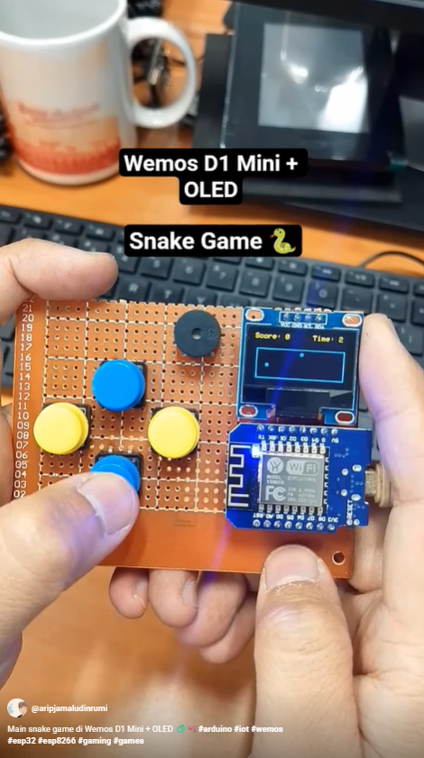

# 🐍 Snake Game on Wemos D1 Mini + OLED + Buzzer

Mini proyek game **Snake klasik** berjalan di **Wemos D1 Mini (ESP8266)** dengan layar OLED 0.96" dan suara buzzer. Game ini dibuat menggunakan 4 tombol untuk kontrol arah dan menampilkan score + timer langsung di layar.

---

## 🎮 Fitur

- Tampilan OLED 128×64 dengan area game 120×40
- Snake bertumbuh saat makan
- Score dan timer real-time
- Suara buzzer saat makan dan game over
- Kontrol 4 tombol (UP, DOWN, LEFT, RIGHT)

---

## 🛠️ Hardware

| Komponen       | Jumlah | Keterangan                    |
|----------------|--------|-------------------------------|
| Wemos D1 Mini  | 1      | Board ESP8266                 |
| OLED 0.96"     | 1      | I2C, alamat default `0x3C`    |
| Tombol tekan   | 4      | Untuk arah                    |
| Buzzer aktif   | 1      | Output suara sederhana        |
| Resistor 10K   | 4      | Pull-down jika diperlukan     |
| Breadboard + Kabel jumper | 1 set | Untuk perakitan         |

---

## ⚡ Wiring

| Fungsi    | Pin ESP8266 (Wemos D1 Mini) |
|-----------|-----------------------------|
| OLED SDA  | D2                          |
| OLED SCL  | D1                          |
| Tombol UP    | D5                      |
| Tombol DOWN  | D6                      |
| Tombol LEFT  | D7                      |
| Tombol RIGHT | D3                      |
| Buzzer       | D4                      |

---

## 📦 Library yang Digunakan

- [Adafruit GFX](https://github.com/adafruit/Adafruit-GFX-Library)
- [Adafruit SSD1306](https://github.com/adafruit/Adafruit_SSD1306)

Install via Library Manager di Arduino IDE.

---

## 🧠 Cara Kerja Game

- Snake bergerak dalam area 120×40 pixel
- Makanan muncul secara acak di grid
- Tombol arah mengubah arah gerak snake
- Snake akan tumbuh dan score bertambah saat makan
- Game over terjadi saat menabrak dinding atau diri sendiri
- Buzzer berbunyi saat makan dan game over

---

## ▶️ Cara Menjalankan

1. Upload sketch ke Wemos D1 Mini
2. Pasang OLED dan tombol sesuai wiring
3. Jalankan board dan mainkan menggunakan tombol
4. Jika snake menabrak dinding atau tubuh sendiri, game berakhir

---

## 📺 Video Demo

---

## 📁 Struktur File
/SnakeGames-WemosOLED/
├── snake_game.ino
├── README.md
└── screenshot.png (optional)
